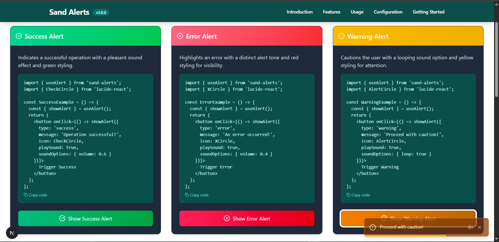

<h1 align="center" id="title"><a href="https://git.io/typing-svg"></a></h1>

<p align="center"></p>

<p id="description">Sand Alert is a professional customizable alert component library built with Next js and TypeScript. It offers an intuitive API for simple yet flexible contextual feedback in web applications. Designed for performance and accessibility it seamlessly integrates into any React project from small to enterprise-scale. With robust state management animations and TypeScript support Sand Alert ensures type safety and enhances developer experience while delivering consistent brand-aligned notifications and prompts for exceptional user experiences.</p>

<h2>🚀 Demo</h2>

[https://sand-alerts.vercel.app/](https://sand-alerts.vercel.app/)

<h2>Project Screenshots:</h2>





  
<h2>🧐 Features</h2>

Here're some of the project's best features:

*   🎨 Highly Customizable: Style alerts to match your application's design system
*   🔄 Smooth Animations: Elegant enter/exit transitions for better UX
*   🔊 Sound Effects - Audio sounds for different alert types
*   ⚡ Lightweight: Less than 5KB gzipped with zero dependencies
*   📱 Responsive: Looks great on all devices and viewport sizes
*   🌐 Accessibility: WCAG 2.1 compliant with proper ARIA attributes
*   🌙 Theming: Built-in light/dark mode support
*   🧩 Component Composition: Build complex alerts with custom content
*   📦 Tree-Shakable: Import only what you need

<h2>🚀 Quick Start </h2>

    import { useAlert } from 'sand-alerts';
    import { CheckCircle } from 'lucide-react';

    //Success alert
    const SuccessExample = () => {
      const { showAlert } = useAlert();
      return (
        <button onClick={() => showAlert({
          type: 'success',
          message: 'Operation successful!',
          icon: CheckCircle,
          playSound: true,
          soundOptions: { volume: 0.6 }
        })}>
          Trigger Success
        </button>
      );
    };

<h2>🛠️ Installation Steps:</h2>

<p>1. Clone the repository</p>

```
git clone https://github.com/sandundil2002/Sand-Alerts.git
```

<p>2. Install dependencies</p>

```
npm install
```

<h2>🍰 Contribution Guidelines:</h2>

Contributions to Sand Alert should use TypeScript for type safety follow React best practices with functional components and hooks and include proper documentation for new features while maintaining the existing project structure and Tailwind CSS styling. The pull request process requires updating documentation when needed ensuring all tests pass adding tests for new functionality requesting maintainer review and addressing feedback. Community members should be respectful and inclusive provide constructive feedback assist others in discussions and issues and adhere to the project's code of conduct.

  
  
<h2>💻 Built with</h2>

Technologies used in the project:

*   React - Core library for building the UI components
*   Next.js - React framework for server-side rendering and routing
*   TypeScript - Used for type-safe JavaScript development
*   Tailwind CSS - Utility-first CSS framework for styling
*   Lucide React - Icon library

<h2>🛡️ License:</h2>

This project is licensed under the MIT License - see the LICENSE file for details.
